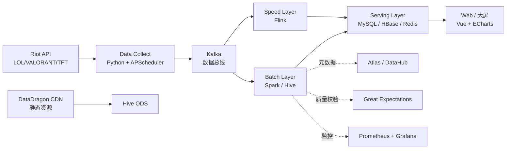
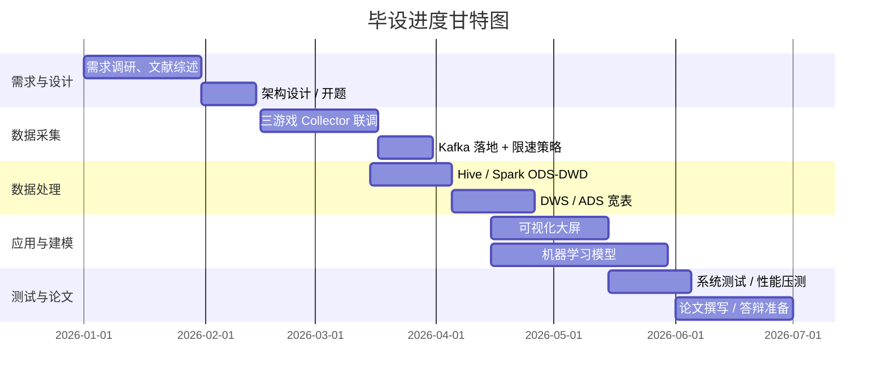

# LOL / 无畏契约(VALORANT) / 云顶之弈(TFT) 电竞大数据分析平台

> **专业方向**：大数据技术  
> **数据源**：Riot Games 官方 API（`RGAPI-xxxxxxxx-xxxx-xxxx-xxxxxxxxxxxxxxxx`，存于 `application.yml` / `.env`，**禁止提交到 Git**）  
> **面向游戏**：League of Legends、VALORANT、Teamfight Tactics  
> **版本**：v0.2 框架模版（请按学校模板调整章节编号）

---

## 摘要

随着全球电子竞技产业的高速发展，《英雄联盟》《无畏契约》《云顶之弈》三款 Riot Games 旗下核心游戏积累了海量的玩家行为数据、比赛数据和版本元数据。针对传统电竞分析存在数据分散、维度单一、实时性差等问题，本文设计并实现了一套基于大数据技术的电竞数据分析平台。平台以 Riot 官方 API 为数据源，采用 `Python + Kafka + Hadoop/HDFS + Hive + Spark + Flink + Vue + ECharts` 的技术架构，完成对多源异构电竞数据的采集、清洗、存储、离线计算、实时统计与可视化分析，并通过英雄/特工 BP 胜率分析、玩家段位画像、比赛胜负预测、阵容聚类等若干应用场景验证了平台的有效性。  
**关键词**：电竞数据；Riot API；大数据分析；Spark；Hive；数据可视化

## Abstract

*(英文摘要，按学校要求 300 词左右，模板如下)*  
With the rapid development of the global esports industry, Riot Games' *League of Legends*, *VALORANT*, and *Teamfight Tactics* have generated massive player behavior data, match data, and patch metadata. Aiming at the problems of data dispersion, single dimension and poor real-time performance in traditional esports analysis, this paper designs and implements an esports data analysis platform based on big data technology. The platform uses the Riot official API as the data source and adopts the technical architecture of `Python + Kafka + Hadoop/HDFS + Hive + Spark + Flink + Vue + ECharts`, completing collection, cleaning, storage, offline computing, real-time statistics and visualization analysis of multi-source heterogeneous esports data. Several application scenarios such as champion/agent pick-ban-win rate analysis, player rank profiling, match outcome prediction and lineup clustering verify the effectiveness of the platform.  
**Keywords**: Esports Data; Riot API; Big Data Analytics; Spark; Hive; Data Visualization

---

## 第一章 绪论

### 1.1 研究背景与意义
- **行业背景**：全球电竞市场规模、用户规模、三款游戏的 DAU/MAU、赛区分布（可引用 Newzoo、Esports Charts 公开报告）。
- **技术背景**：传统电竞分析多依赖 Excel / 单一爬虫 / 第三方网站，存在数据滞后、口径不一、难以横向对比的问题。
- **研究意义**：
  - 理论意义：探索大数据技术在垂直行业（电竞）的应用范式。
  - 实践意义：为玩家、教练、解说、自媒体提供一个统一的数据洞察入口。

### 1.2 国内外研究现状
- **国外**：Riot 官方 `Riot Developer Portal`、Oracle's Elixir（LOL 比赛数据）、rib.gg（VALORANT 比赛数据）、Mobalytics、Blitz.gg 等。
- **国内**：玩加电竞、OP.GG 中国版、掌上英雄联盟、虎牙/斗鱼数据后台、清华、北邮等院校的相关论文。
- **现存不足**：多游戏统一分析少、缺少实时维度、缺少年级/省级毕设级别的完整工程实现。

### 1.3 研究内容与目标
- **研究内容**：
  1. 多游戏、多端点（Riot API 多产品线）的数据采集与整合。
  2. 离线 + 实时双链路数据处理。
  3. 玩家画像、版本元分析、胜负预测等 3~5 个具体分析主题。
  4. **PC 端 + 移动 H5 + 微信小程序三端适配**（uni-app 一套代码编译 H5 + 小程序，PC 单独 Vue 3 工程），后端统一 RESTful API。
  5. Web 端可视化大屏。
- **研究目标**：搭建一个可演示、可扩展、文档完整的大数据分析系统原型，**三端差异化展示**（PC 大屏、移动查询、小程序上分助手）。

### 1.4 论文组织结构
简述每一章的主要内容（对应下面 2~8 章）。

---

## 第二章 相关技术与工具

### 2.1 拳头游戏 Riot API 介绍
- **API 体系**：
  - LOL：`/lol/summoner/v4`、`/lol/league/v4`、`/lol/champion-mastery/v4`、`/lol/match/v5`、`/lol/spectator/v5`
  - VALORANT：`/val/content/v1`、`/val/match/v1`、`/val/ranked/v1`
  - TFT：`/tft/league/v1`、`/tft/match/v1`、`/tft/summoner/v1`
- **路由规则（容易踩坑）**：
  - **v3 / v4 / Spectator** 走 **platform** 路由：`na1 / euw1 / kr / br1 / jp1 / ...`
  - **Match v5 / Account v1** 走 **regional** 路由：`americas / europe / asia / esports / sea`
  - 一次请求需要 **2 个值**：`platform`（查 v4 用）+ `region`（查 v5 用）
  - 召唤师改名后 Riot 推荐用 **PUUID** 而非 name 做主键
- **认证方式**：`X-Riot-Token` 请求头，**个人开发 Key 限速 20 req/s、100 req/2min**。
- **关键约束**：
  - Key 有有效期（一般 24h 需刷新，长效 Key 需走 Production 申请）。
  - 多数数据有 10~15 分钟延迟。
  - 部分端点（Match 详情）有 **match-v5 名单回溯** 限制，召唤师主动拉取范围与排队策略需设计。
- **静态资源（DataDragon，必用）**：
  - LOL 的英雄图标、技能图标、英雄数值表并不在 `/lol` 端点里，而是 Riot 单独维护的 CDN：`https://ddragon.leagueoflegends.com/cdn/{patch}/data/{lang}/champion.json` 等。
  - 前端展示英雄头像/技能图必须接入 DataDragon，论文里要写明数据源链路。

### 2.2 大数据技术栈
| 层级 | 选型 | 用途 |
| --- | --- | --- |
| 数据采集 | Python `requests` / `riotwatcher` / `httpx` + `APScheduler` | 定时拉取 API |
| 消息队列 | Kafka (KRaft 模式) | 解耦采集与计算、削峰、DLQ 失败重试 |
| 分布式存储 | HDFS、Hive 3.x（ACID / ORC + Snappy）、HBase（可选，存时序段位） | 原始数据仓 + 维度表 + 时序表 |
| 关系型 / 缓存 | MySQL 8（维度/服务层）、Redis 7（热数据 / 排行榜） | 高频查询、排行榜、热点缓存 |
| 搜索引擎 | Elasticsearch 8（玩家标签 / 全文检索，可选） | 标签层、模糊查询 |
| 离线计算 | Spark SQL / Spark Core、HiveQL | 批处理 T+1 分析（ODS→DWD→DWS→ADS） |
| 实时计算 | Flink 1.18（可选） | 实时榜单、实时热度、实时段位变动 |
| 任务调度 | Airflow 2.x / DolphinScheduler 3.x | DAG 编排、定时依赖 |
| 机器学习 | Spark MLlib、scikit-learn、LightGBM、XGBoost | 胜负预测、聚类、特征工程 |
| 模型服务化 | MLflow / Triton Inference Server / FastAPI 包装 | 模型上线、A/B 实验 |
| 元数据 / 血缘 | Apache Atlas / DataHub（可选，论文中可截图） | 数据治理、字段血缘 |
| 数据质量 | Great Expectations / Deequ | 入仓校验、异常告警 |
| 监控告警 | Prometheus + Grafana + AlertManager | QPS、延迟、采集失败率 |
| 日志 | ELK（Elasticsearch + Logstash + Kibana）/ Loki + Promtail | 采集/计算全链路日志 |
| 容器化 | Docker、Docker Compose | 一键部署演示 |
| CI/CD | GitHub Actions / GitLab CI | 自动化测试、镜像构建 |

### 2.3 前端三端架构（PC + Mobile + 小程序）
> 三端**共用一套后端 RESTful API**，前端按平台拆分，定位差异化。

#### 2.3.1 三端定位与功能切分
| 端 | 形态 | 主要场景 | 核心功能 |
| --- | --- | --- | --- |
| **PC 端**（网页） | Vue 3 大屏 + 详情站 | 答辩演示 / 教练内训 / 数据观察 | 数据大屏、英雄 BP 报表、胜负预测 SHAP 解释、比赛回放、玩家全量画像 |
| **移动端**（H5） | uni-app → H5 | 玩家在路上用手机查战绩 | 玩家战绩查询、英雄数据、段位分布、版本元榜、跨端收藏 |
| **小程序**（微信） | uni-app → mp-weixin | 上分助手 / 一键查询 | 召唤师快速查询、上分英雄推荐、阵容查询、消息订阅 |

#### 2.3.2 技术选型
| 端 | 选型 | 关键依赖 |
| --- | --- | --- |
| PC | Vue 3 + Vite + TypeScript + Pinia + Vue Router 4 | ECharts 5、DataV-Vue、Element Plus、Axios |
| 移动 H5 + 小程序 | **uni-app x**（Vue 3 + TS 语法）+ Vite | uView UI 2、uni-ui、@dcloudio/uni-app |
| 后端 | Spring Boot 3 + MyBatis-Plus（推荐）/ FastAPI | MyBatis-Plus、Spring Security、JWT、Hutool |
| 接口文档 | Knife4j（Spring Boot）/ Swagger（FastAPI） | 前后端联调用 |

#### 2.3.3 跨端复用与差异点
- **共享**：API 请求封装（`request.ts` 统一拦截 / 鉴权 / 错误处理）、TypeScript 类型定义（`@shared/types`）、常量与枚举（如段位枚举、英雄 ID 映射）。
- **差异**：
  - 鉴权：PC 走 `HttpOnly Cookie`，H5 走 `localStorage + Header`，小程序走 `wx.setStorageSync`。
  - 路由：PC 用 vue-router，移动/小程序用 uni-app 自带 pages.json。
  - 组件：PC 用 Element Plus，移动/小程序用 uView UI（小程序不支持复杂 CSS 选择器）。
  - 图表：PC 端 ECharts 全力出，移动端 ECharts 轻量版（按需引入）/ uCharts，小程序端 **ECharts 不可用**，必须用 [uCharts](https://www.ucharts.cn/) 或 `wx-charts`。
  - 适配：PC 端响应式（≥1280px 宽屏设计）+ 移动端 rpx（uni-app 自适应）。

#### 2.3.4 uni-app 编译目标
```bash
# H5（移动端浏览器）
npm run build:h5
# 微信小程序
npm run build:mp-weixin
# 产物分别在 dist/build/h5、dist/build/mp-weixin，用微信开发者工具打开
```

### 2.4 其他工具
- 版本控制：Git + Gitee/GitHub（**API Key 走 .gitignore**）
- 文档：Markdown + Typora / Obsidian
- 建模：draw.io / ProcessOn / PowerDesigner（架构图、E-R 图、数据流图）
- 测试：Pytest、JUnit 5、Postman / Apifox、JMeter / Locust（压测）
- 演示：录屏 OBS + 答辩 PPT，**小程序用微信开发者工具真机扫码演示**

---

## 第三章 系统需求分析

### 3.1 功能性需求
| 编号 | 需求名称 | 描述 | 端 | 优先级 |
| --- | --- | --- | --- | --- |
| F1 | 多游戏数据采集 | 同时支持 LOL / VALORANT / TFT 三套 API | 后台 | 高 |
| F2 | 玩家档案查询 | 输入召唤师名/ID 拉取其多赛季段位、英雄池 | PC / H5 / 小程序 | 高 |
| F3 | 英雄/特工 BP 胜率分析 | 当前版本各英雄出场率、胜率、禁用率 | PC / H5 | 高 |
| F4 | 比赛数据明细查询 | 单场比赛的逐帧经济、技能时间线 | PC | 中 |
| F5 | 玩家段位分布 | 各区服段位人数分布 | PC / H5 | 中 |
| F6 | 胜负预测 | 输入双方近 10 场表现，预测胜率 | PC | 中 |
| F7 | 阵容聚类 | TFT 当前版本 Top 阵容聚类 | PC / 小程序 | 低 |
| F8 | 实时热度榜 | Flink 实时计算 24h 上分热门英雄 | PC / 小程序 | 低 |
| F9 | PC 数据大屏 | 中心 Dashboard，多图表联动 | PC | 高 |
| F10 | 移动端战绩查询 | H5 端玩家战绩 / 段位 / 英雄池 移动端优化布局 | H5 | 高 |
| F11 | 小程序上分助手 | 输入召唤师 → 推荐上分英雄 + 风险提示 | 小程序 | 高 |
| F12 | 小程序订阅推送 | 用户订阅特定玩家，新比赛触发微信订阅消息 | 小程序 | 中 |
| F13 | 三端统一鉴权 | 一套账号可在三端登录，Token 跨端同步 | 全部 | 高 |
| F14 | 三端响应式 / 跨端兼容 | PC 适配 ≥1280px，H5 适配 375~768px，小程序支持各尺寸 | 全部 | 高 |

### 3.2 非功能性需求
- **性能**：单页面 P95 < 2s，大屏首屏 < 3s。
- **可用性**：采集任务失败自动重试 3 次并告警。
- **扩展性**：新增一个 Riot 游戏（如英雄联盟手游）只需新增一个采集器。
- **安全**：API Key 加密存储（推荐 Vault / 至少 .env），敏感接口鉴权。
- **可维护**：模块化、日志规范（log4j2 / loguru）、接口文档（Swagger / Apifox）。

### 3.3 数据流分析
画出"数据源 → 采集 → 队列 → 存储 → 计算 → 服务 → 展示"的端到端数据流图（论文里用 Visio/draw.io 画）。

### 3.4 数据量与性能估算
- **日增量**（按 seed 池 1000 个召唤师 × 3 游戏估算）：
  - LOL 比赛明细：约 5 万条 / 天
  - VALORANT 比赛明细：约 2 万条 / 天
  - TFT 比赛明细：约 1 万条 / 天
  - 段位快照：1000 × 3 × 1 = 3000 条 / 天
  - 原始 JSON 平均每条 30KB，压缩后 Parquet 约 1~2KB/条
  - **月存储量**：约 20~40 GB（Parquet 压缩后）
- **峰值 QPS**：采集层峰值 ≤ 20 req/s（受 Key 限速）；前端峰值 200 QPS（压测按 500 QPS 设计）。
- **延迟要求**：批处理 SLA 4h 内出 ADS；实时榜单端到端延迟 ≤ 30s。

### 3.5 部署与运维需求
- **环境**：开发（本地 Docker Compose）、演示（5 节点集群）、生产（K8s 可选，毕设可不深究）。
- **CI/CD**：GitHub Actions 跑测试 + 镜像构建；`docker-compose up` 一键起演示环境。
- **可观测性**：Prometheus + Grafana + 日志聚合，毕设答辩时现场展示大盘。
- **备份**：MySQL 每天 mysqldump，Hive 元数据走 HMS 备份。

---

## 第四章 系统架构设计

### 4.1 总体架构
采用经典的 **Lambda 架构**（批 + 速 + 服务三层）。



> 论文里需补：① 物理部署拓扑图（机器-IP-角色）；② 关键数据流（Data Flow）图。

### 4.2 数据采集层
- **采集器设计**：
  - `LolCollector`、`ValorantCollector`、`TftCollector` 继承统一接口 `BaseCollector`。
  - 入口：`config/games/{game}.yml` 配置 `region`、`platform`（按 v4/v5 分别配置）、采集频率、抓取对象（summoner 列表 / matchId 池）。
- **关键技术**：
  - Token 轮询与刷新：单 Key + Key 池（多 Key 轮询可提升 5x 吞吐）。
  - 限速控制：令牌桶（`aiolimiter`） + 全局 Redis 计数器。
  - 反爬兜底：指数退避（1s→2s→4s→8s，上限 60s）+ 失败队列入 Kafka DLQ。
  - **种子数据策略**：先用几个高知名度召唤师/战队 ID 拉 matchId 列表，再扩散。
  - **增量 / 回补策略**：
    - 每条 Kafka 消息带 `ingest_ts`、`match_creation_ts`，落地 Hive 按 `dt` 分区。
    - matchId 用布隆过滤器 / Hive 外表 `INSERT OVERWRITE` 去重，避免重复入库。
    - 断点续传：Airflow 任务记录 checkpoint，失败后从断点恢复。
  - **采集范围**：
    - 静态（每小时 1 次）：版本号、英雄/特工/棋子元数据、DataDragon 资源。
    - 慢变（每天 1 次）：段位排行榜、赛季元信息。
    - 事件驱动：每个 seed summoner 的比赛列表 6h 拉一次。

### 4.3 数据存储层
| 库 | 存储内容 | 选型理由 |
| --- | --- | --- |
| 原始日志 | JSON API 响应 | HDFS + 分区（按 `game/date/game_mode`） |
| ODS 层 | 原始 JSON → ORC 落 Hive 外表 | 保留原始 schema、便于回溯 |
| DWD 层 | 字段统一、缺失值填补、PUUID 脱敏 | ORC + Snappy 压缩 |
| DWS 层 | 宽表（玩家/英雄/阵容/段位/地图） | 预聚合减少 ADS 计算 |
| ADS 层 | 服务层直读 | MySQL 8 同步 + Redis 缓存 |
| 时序层 | 段位/积分随时间变化 | HBase（宽表 + rowkey 设计为 `puuid#ts`） |
| 标签层 | 玩家画像、阵容标签 | MySQL + Elasticsearch（全文检索） |
| 静态资源 | DataDragon 拉取的英雄图、技能图标 | 对象存储 MinIO / 本地缓存 |

#### 4.3.1 数据模型（示例）
```text
-- 维度
dim_player(player_id, game, puuid, summoner_name, region, level, update_ts)
dim_champion(champion_id, game, name, role, release_date, icon_url, ...)
dim_agent(agent_id, game, name, role, icon_url, ...)            -- VALORANT
dim_comp(comp_id, game, comp_name, traits, tier, ...)          -- TFT
dim_patch(patch, game, release_date, season, ...)

-- 事实
fact_match(match_id, game, game_mode, duration_sec, patch, creation_ts, ...)
fact_match_player(match_id, player_id, champion_id, kills, deaths, assists, win,
                  damage_dealt, gold_earned, vision_score, ...)
fact_match_team(match_id, team_id, side, first_blood, first_dragon, ...)
fact_ranking_snapshot(player_id, snapshot_date, tier, rank, lp, wins, losses)
fact_tft_comp_placement(match_id, comp_id, placement, ...)     -- TFT 1~8 名

-- 应用层
ads_champion_stats_d(game, patch, role, champion_id, games, wins, pick_rate, ban_rate, win_rate)
ads_player_profile(player_id, main_role, hero_pool_score, recent_kda, ...)
ads_match_prediction_features(match_id, blue_win_pred, blue_win_prob)
```

#### 4.3.2 数据治理（加分章节，强烈建议写）
- **数据质量**：Great Expectations / Deequ 校验"非空、唯一、值域"，失败入 `dqc_result` 表并告警。
- **元数据管理**：Apache Atlas / DataHub，记录 Hive 表的字段血缘（"ads_champion_stats_d 来自 dws_match_player"）。
- **数据安全**：PUUID 在 DWD 层就 SHA-256 哈希后再下游使用，避免原始标识符落 ADS。
- **生命周期**：HDFS 原始数据 90 天后冷归档到对象存储；ADS 表保留 365 天。

#### 4.3.3 分区与压缩
- Hive 分区键：`game, dt, game_mode`，按月合并小文件（`ALTER TABLE ... CONCATENATE`）。
- Spark 输出：`partitionBy("dt", "game_mode") + bucketBy(16, "player_id")`，提升 join 性能。

### 4.4 数据处理层
- **离线（Spark）**：
  - ODS → DWD → DWS → ADS 四层建模。
  - 典型任务：
    - `dwd_match_player`：原始 JSON 拍平为宽表，缺失值、异常值处理。
    - `dws_champion_stats_d`：每英雄每日 BP 胜率、热度分位。
    - `dws_player_profile_d`：玩家综合画像（主玩位置、英雄池广度、活跃时段、段位轨迹）。
    - `ads_match_prediction_features`：训练样本拼接（见 5.4 特征工程）。
  - 调度：Airflow DAG，每天 02:00 触发批处理；每个 DAG 节点自带失败重试 + 邮件告警。
- **实时（Flink，可选）**：
  - 实时 Top10 英雄上分榜、实时新区段位新增。
  - 状态后端 RocksDB，Checkpoint 到 HDFS，Exactly-Once 语义。
  - Flink SQL 关联 Hive Catalog，ADS 实时写 Redis。
- **任务调度**：Airflow 2.x / DolphinScheduler 3.x，DAG 任务依赖可视化。

### 4.5 数据分析层（应用方向可三选一或全做）
> 建议至少落地 **3 个分析主题**，按工作量分配章节；至少 1 个要带机器学习。

| 主题 | 描述 | 关键技术 | 工作量 |
| --- | --- | --- | --- |
| ① 版本元分析 | 当前/历史版本英雄 BP、胜率、热度趋势 | HiveQL、Spark SQL、ECharts 折线/热力 | ★★ |
| ② 玩家多维画像 | 段位、主玩位置、活跃时段、胜率、英雄池 | Spark SQL、用户画像标签、KMeans 聚类 | ★★ |
| ③ LOL 比赛胜负预测 | 基于近 N 场表现构建 LGBM/XGBoost 二分类 | scikit-learn / Spark MLlib、MLflow | ★★★ |
| ④ TFT 阵容聚类 | 当前版本 Top 阵容 + 棋子升星推荐 | KMeans、Apriori 关联规则、协同过滤 | ★★★ |
| ⑤ VALORANT 特工地图分析 | 各地图各特工的胜率与经济曲线 | Spark SQL、ECharts 桑基图/热力 | ★★ |
| ⑥ 跨游戏用户行为 | 同时玩多款 Riot 游戏的玩家行为对比 | 用户识别（Riot Account 关联）、留存分析 | ★★★★ |
| ⑦ LOL 比赛事件序列挖掘 | 大龙 / 小龙 / 团战时序对胜负的影响 | Spark MLlib PrefixSpan、关联规则 | ★★★ |
| ⑧ 段位预测 / 上分路径 | 根据近 30 场表现预测能否上分 | LightGBM 回归、SHAP 解释 | ★★★ |

### 4.6 数据可视化层（三端差异化设计）

#### 4.6.1 PC 端（大屏 + 详情站）
- **大屏页**（`/dashboard`，1920×1080 自适应）：
  - 中心：当前版本 Top 英雄/特工/阵容轮播。
  - 左侧：实时新增比赛流、实时热门英雄。
  - 右侧：玩家段位分布、胜率雷达。
  - 底部：跨游戏数据对比柱状图、版本更新时间线。
- **详情站**（响应式 PC 网站）：
  - 玩家详情页：基础信息 + 段位轨迹 + 英雄池雷达 + 近 20 场战绩表 + 胜负预测。
  - 英雄详情页：BP 胜率趋势、对位克制、胜率最高的 5 个召唤师技能搭配。
  - 比赛回放页：双方经济曲线、关键事件时间线（小龙 / 大龙 / 团战）。
- **报表 / 分析页**：SHAP 解释、模型评估、聚类结果散点图。
- **图表库**：ECharts 5（主力）、AntV G6（关系图）、DataV-Vue（首屏大屏装饰）。

#### 4.6.2 移动端 H5
- **首页**（Tab Bar：首页 / 战绩 / 英雄榜 / 我的）：
  - 首页：跨游戏数据快讯卡片流、当前版本 Top 阵容卡片。
  - 战绩：搜索召唤师 → 段位卡 + 近 10 场战绩列表 + 英雄池饼图。
  - 英雄榜：LOL / VALORANT / TFT 三 Tab，当前版本 BP 胜率榜。
  - 我的：登录、订阅管理、设置。
- **图表库**：ECharts 5（按需引入）+ 自适应 rpx 布局。
- **性能优化**：图片懒加载、虚拟列表、首屏 SSR（可选）。

#### 4.6.3 微信小程序
- **首页**（上分助手入口）：
  - "🔍 输入召唤师" → 调用后端 `/api/player/recommend` → 推荐上分英雄 + 风险提示。
  - "📊 当前版本强度榜" → 简版排行榜。
  - "🔔 我的订阅" → 关注的玩家新比赛推送列表。
- **图表库**：uCharts（小程序专用，体积小）或 wx-charts（**不能用 ECharts 原生包**）。
- **小程序特性**：
  - 微信登录（`wx.login` → 后端换 session）。
  - 订阅消息（`wx.requestSubscribeMessage`）：用户订阅后，新比赛触发推送。
  - 分享卡片：自定义分享图（云函数 / canvas 绘制）。
- **限制**：单包 ≤ 2MB，总包 ≤ 20MB；域名必须 HTTPS 且备案。

#### 4.6.4 三端公共规范
- **设计语言**：统一色板 / 字体 / 图标（推荐 [Arco Design 资源](https://arco.design/) + 自定义电竞主题色）。
- **API 协议**：RESTful + JSON，详见 5.5 接口设计。
- **错误处理**：统一 `code` / `msg` / `data` 三段式；前端按 `code` 弹 Toast 或跳登录。
- **埋点**：可选三端统一埋点上报到 Kafka，进入 ADS 做用户行为分析。

---

## 第五章 系统详细设计与实现

### 5.1 数据采集模块
- 关键类：`BaseCollector`、`RateLimiter`、`TokenPool`、`CollectorScheduler`。
- 关键代码示例（伪代码）：
  ```python
  class LolCollector(BaseCollector):
      def run(self):
          for summoner in self.seed_summoners:
              match_ids = self.api.match.matchlist_by_puuid(summoner.puuid)
              for mid in match_ids:
                  raw = self.api.match.get_match(mid)
                  self.kafka.send("lol_match_raw", raw)
  ```
- 重点写 **限速策略**、**失败重试**、**Token 刷新** 三件事。

### 5.2 数据存储模块
- Hive 建表语句、Parquet 分区策略。
- Redis 缓存热门英雄/玩家。

### 5.3 数据处理模块
- Spark ODS → DWD 清洗脚本（字段映射、缺失值、异常值）。
- 一段 Spark SQL 例子（BP 胜率宽表）。

### 5.4 数据分析模块
- **5.4.1 离线分析**：版本元分析、玩家画像、段位分布、热度榜单。
- **5.4.2 机器学习模型**（推荐做胜负预测或阵容聚类）：
  - **特征工程（必写细）**：
    - 玩家近 N 场（10/20/50）KDA、参团率、伤害转化率、经济转化率。
    - 英雄池广度（近 30 场不同英雄数 / 30）、主英雄熟练度（按 mastery points）。
    - 队伍维度：双方近 10 场胜率、双方 Elo 估计（自实现简单 Elo）。
    - 比赛上下文：版本、地图、模式、双方平均段位差。
    - TFT 特征：羁绊组合 one-hot、棋子星级分布、装备组合。
  - **模型选型**：
    - 胜负预测：LightGBM / XGBoost 二分类，输出胜率。
    - 阵容聚类：KMeans（肘部法则选 K）+ DBSCAN 噪声检测。
    - 段位预测：LightGBM 回归 + SHAP 解释。
  - **评估指标**：
    - 二分类：AUC、KS、LogLoss、Top-1 准确率。
    - 聚类：轮廓系数、Calinski-Harabasz。
    - 回归：RMSE、MAE、R²。
  - **实验设计**：按时段切分训练/验证/测试集（避免数据泄漏），做 5 折交叉验证。
  - **可解释性**：用 SHAP 输出 Top10 重要特征（图必出）。

### 5.5 可视化模块（三端实现）
- **5.5.1 PC 端实现**：
  - 路由：`vue-router 4` 按角色（公开 / 用户）懒加载。
  - 状态：Pinia 管登录态、用户偏好。
  - 大屏：DataV-Vue + ECharts 8 个核心图表，30s 自动轮播；用 `requestAnimationFrame` 优化。
  - 关键接口：
    - `GET /api/dashboard/overview`：大屏首页聚合数据
    - `GET /api/player/{puuid}/profile`：玩家详情
    - `GET /api/champion/{id}/stats?patch=14.10`：英雄版本数据
    - `POST /api/match/predict`：胜负预测（入参双方 puuid + 双方近 N 场 IDs）
  - 鉴权：JWT 存 HttpOnly Cookie + CSRF Token。
- **5.5.2 移动 H5 + 小程序实现**（uni-app 一套代码）：
  - 工程：`frontend-uniapp/`，`pages.json` 配置路由与 TabBar。
  - 状态：Pinia（uni-app 版）+ `uni.getStorageSync` 持久化。
  - 网络：`uni.request` 封装 `request.ts`（统一拦截器、Token 注入、错误 Toast）。
  - 关键页面：
    - `pages/index/index` 首页
    - `pages/player/player-detail` 玩家详情
    - `pages/champion/rank-list` 英雄榜
    - `pages/recommend/recommend` 上分助手
    - `pages/subscribe/subscribe-manage` 订阅管理
  - 鉴权：
    - H5 走 `localStorage`，小程序走 `uni.setStorageSync`。
    - 后端用 `X-Token` Header 统一接收。
  - 编译：
    ```json
    // manifest.json
    "mp-weixin": { "appid": "wx...", "lazyCodeLoading": true },
    "h5": { "router": { "mode": "hash" }, "title": "电竞数据分析" }
    ```
- **5.5.3 接口规范（后端对三端）**：
  - RESTful 风格：`GET /api/{module}/{action}?params` 或 `POST /api/{module}/{action} Body:json`。
  - 统一返回结构：
    ```json
    {
      "code": 0,
      "msg": "ok",
      "data": { ... }
    }
    ```
  - 错误码：`0` 成功，`401` 未登录，`403` 无权限，`5xx` 系统错误。
  - 分页：`{ page, pageSize, total, list }`。
  - 接口文档：Knife4j（Spring Boot）或 Swagger（FastAPI）自动生成。
- **5.5.4 三端 UI 截图**（必出图）：
  - PC 大屏 1 张（1920×1080）
  - PC 详情页 1 张
  - H5 首页 1 张（iPhone 13 模拟）
  - 小程序首页 1 张（微信开发者工具截图）
  - 小程序"上分助手"结果页 1 张

### 5.6 监控与告警模块（论文加分）
- Prometheus 抓取 Spark/Flink/Kafka/Collector 指标（自定义 exporter）。
- Grafana 大盘：
  - 采集 QPS / 限速命中率 / DLQ 堆积量
  - Spark 任务耗时 / shuffle 量 / OOM
  - Kafka lag / topic 消息速率
  - MySQL 慢 SQL / Redis 命中率
- AlertManager 规则：采集失败率 > 5% 持续 5min → 邮件 / 钉钉告警。

### 5.7 模型服务化模块（机器学习主题必写）
- 训练：离线 Spark 训练 → MLflow Tracking 记录参数 / 指标 / 模型。
- 上线：
  - 轻量：FastAPI 加载 `.pkl` 提供 `/predict` 接口。
  - 进阶：Triton Inference Server + ONNX，支撑高并发。
- 监控：模型输入分布漂移检测（PSI / KS）、预测准确率随时间变化曲线。
- A/B 实验：通过网关分流（如 10% 流量走新模型），对比业务指标。

### 5.8 数据治理模块（论文加分）
- 数据质量校验脚本（Great Expectations）随 Spark 任务跑。
- 元数据采集：Atlas Hook 自动注册 Hive 表、字段血缘。
- 数据安全：PUUID 哈希脱敏（SHA-256 + salt）。

---

## 第六章 系统测试与结果分析

### 6.1 测试环境
- **硬件**：5 台 8C16G 云服务器（或 1 台 + Docker 模拟）。
- **集群**：HDFS 3.x（3 副本）、Kafka 3.x KRaft 3 broker、Spark 3.5（1 master + 3 worker）、Flink 1.18（1 JM + 2 TM）、MySQL 8、Redis 7。
- **数据规模**（实际跑完后回填）：
  - LOL 比赛明细：~X 万条
  - VALORANT 比赛明细：~Y 万条
  - TFT 比赛明细：~Z 万条
  - 玩家档案：~P 万条
  - 总存储量：~T GB（Parquet 压缩后）

### 6.2 功能测试
| 测试类型 | 工具 | 覆盖范围 | 通过标准 |
| --- | --- | --- | --- |
| 单元测试 | Pytest / JUnit 5 | 工具类、Spark UDF、特征计算 | 覆盖率 ≥ 70% |
| 接口测试 | Postman / Apifox / JUnit | F1~F9 所有 API | 用例 100% 通过 |
| 数据一致性 | Deequ | "match 数量=10×玩家比赛数"、外键完整性 | 0 个 ERROR 级违规 |
| 端到端 | 自动化脚本 | "采集→Kafka→Hive→ADS→MySQL→前端" | 看板数据与原表一致 |

### 6.3 性能测试
| 层级 | 工具 | 场景 | 指标 |
| --- | --- | --- | --- |
| 采集层 | 自压测 | 1/5/10 节点、20 req/s 限速 | 稳定运行 24h、DLQ < 100 |
| 计算层 | Spark History | 30 天数据 | 单 DAG < 30min、Shuffle < 200GB |
| 实时层 | Flink Dashboard | 持续 Kafka 流量 | Lag < 5s、Checkpoint 成功率 100% |
| 展示层 | JMeter / Locust | 100/500/1000 并发 | P95 < 2s、错误率 < 0.1% |
| 模型服务 | wrk / ab | 100/500 QPS | P95 < 100ms、QPS ≥ 500 |

### 6.4 业务结果分析
- **模型效果**：胜负预测 AUC、KS、Top-1 准确率（绘图 + 表格）。
- **业务结论**：
  - 当前版本（具体版本号）Top10 英雄 BP 胜率排行。
  - VALORANT 各地图强度差距。
  - TFT 主流阵容 Top5 与棋子升星推荐。
- **可视化大屏截图**：大屏 1~2 张 + 移动端 1 张。
- **用户反馈**：邀请 5~10 名同学体验，收集 1 份可用性问卷（NPS ≥ 30）。

---

## 第七章 总结与展望

### 7.1 总结
- 完成了哪几件事、解决了哪些问题、创新点（多游戏统一分析？实时榜单？）。
- 不足：数据延迟、API 限速、模型精度。

### 7.2 展望
- 接入更多 Riot 游戏（如 Project L、Wild Rift）。
- 引入大模型做解说文案生成、BP 策略推荐。
- 私有化部署到战队内训场景。

---

## 第八章 项目管理与创新点（毕设必加）

### 8.1 项目进度安排（甘特图）
用 mermaid 画出 6 个月进度：



### 8.2 风险评估与应对
| 风险 | 等级 | 应对 |
| --- | --- | --- |
| Riot API Key 频繁失效 | 高 | 多 Key 轮询 + 申请长效 Key |
| API 限速 20 req/s 不够用 | 中 | 多进程 / 多 Key 池 + 排队策略 |
| API 字段变更 / 弃用 | 中 | 抽象 BaseCollector + 字段版本号 + 灰度采集 |
| 单机资源不足以跑完整 Spark | 中 | 拆 Docker 集群 / 减小回溯窗口 |
| 模型效果差（AUC < 0.55） | 中 | 加特征（对手强度、英雄克制矩阵）、换 XGBoost / 集成学习 |
| 论文查重不过 | 低 | 提早 1 个月起稿、AI 工具查重 |

### 8.3 创新点（写论文时务必显式列出 3 条）
1. **多游戏统一分析平台**：业界多为单游戏分析（OP.GG / 掌上 LOL），本文首次把 LOL / VALORANT / TFT 三款 Riot 游戏数据在同一数据仓库与同一大屏中横向对比。
2. **Lambda 架构在电竞垂直领域的工程落地**：批 + 速 + 服务三层完整跑通，并引入数据治理（Great Expectations + Atlas + 脱敏）。
3. **可解释胜负预测模型**：用 LightGBM + SHAP 解释"为什么预测蓝方胜"，不只是黑盒概率。
4. （可选）**TFT 阵容关联规则挖掘**：用 Apriori 发现隐藏的"羁绊×装备"组合。
5. （可选）**段位预测 + 上分路径推荐**：从描述性分析升级到规范性建议。

---

## 参考文献（示例，凑 ≥ 20 篇）
1. Riot Games. *Riot Developer Portal Documentation*[EB/OL]. https://developer.riotgames.com/, 2026.
2. Riot Games. *DataDragon Documentation*[EB/OL]. https://developer.riotgames.com/docs/lol, 2026.
3. 李航. 统计学习方法[M]. 北京：清华大学出版社, 2019.
4. 周志华. 机器学习[M]. 北京：清华大学工业出版社, 2016.
5. Apache Spark. *Spark SQL, DataFrames and Datasets Guide*[EB/OL]. https://spark.apache.org/docs/latest/sql-programming-guide.html, 2026.
6. Apache Flink. *Flink Documentation*[EB/OL]. https://nightlies.apache.org/flink/flink-docs-stable/, 2026.
7. Apache Kafka. *Kafka Documentation*[EB/OL]. https://kafka.apache.org/documentation/, 2026.
8. Chen T, Guestrin C. *XGBoost: A Scalable Tree Boosting System*[C]// KDD. 2016.
9. Ke G, et al. *LightGBM: A Highly Efficient Gradient Boosting Decision Tree*[C]// NeurIPS. 2017.
10. Lundberg S M, Lee S I. *A Unified Approach to Interpreting Model Predictions (SHAP)*[C]// NeurIPS. 2017.
11. Marz N, Warren J. *Big Data: Principles and best practices of scalable real-time data systems*[M]. Manning, 2015.
12. （其余按学校格式补 GB/T 7714 引文，至少 20 篇，引用：① Elixir/rib.gg 等数据源；② 至少 2 篇知网相关硕博；③ Hive/Spark/Flink/Kafka 官方文档）

## 致谢
标准致谢段落。

---

## 附录 A：项目结构建议（三端 + 后端 + 大数据）
```
esports-bigdata/
├── config/                       # 配置文件（含 .env 模板，**不要提交**）
├── collectors/                   # 三款游戏的采集器
├── kafka/                        # 主题、Schema
├── spark-jobs/                   # 离线任务
├── flink-jobs/                   # 实时任务
├── ml/                           # 机器学习模型与训练脚本
├── backend/                      # Spring Boot / FastAPI 后端
│   ├── src/main/java/...
│   ├── src/main/resources/
│   └── pom.xml / build.gradle
├── frontend-pc/                  # PC 端（大屏 + 详情站）
│   ├── src/
│   │   ├── views/                # 页面
│   │   ├── components/           # 组件
│   │   ├── api/                  # API 封装
│   │   └── router/
│   └── vite.config.ts
├── frontend-uniapp/              # 移动 H5 + 微信小程序（uni-app）
│   ├── pages/                    # 页面（vue 文件）
│   │   ├── index/
│   │   ├── player/
│   │   ├── champion/
│   │   ├── recommend/
│   │   └── subscribe/
│   ├── components/               # 共享组件
│   ├── api/                      # 跨端 API 封装
│   ├── store/                    # Pinia
│   ├── static/                   # 静态资源
│   ├── manifest.json             # uni-app 应用配置
│   └── pages.json                # uni-app 路由
├── shared/                       # 前后端共享
│   └── types/                    # TypeScript 类型定义（与后端 DTO 对齐）
├── docker/                       # docker-compose 一键起集群
│   └── docker-compose.yml
├── sql/                          # Hive/MySQL DDL
├── docs/                         # 论文、PPT、截图
└── README.md
```

## 附录 B：API Key 使用与安全规范
1. **绝不**把 `RGAPI-...` 提交到任何代码仓库。
2. 用 `.env` 文件管理，`.gitignore` 加 `.env`。
3. 通过 `os.getenv("RIOT_API_KEY")` 读取，禁止硬编码。
4. 生产环境建议走 Spring Cloud Config / Apollo / Vault。
5. 个人 Key 默认 24h 失效，每天定时任务调 `POST /api/refresh` 或申请长效 Key。
6. **多 Key 池**：用 3~5 个开发 Key 轮询可提升 3~5x 吞吐，避免单 Key 限速瓶颈。
7. **隐私合规**：PUUID 属准标识符，下游 ADS 表建议 SHA-256 + salt 哈希后再使用，符合《个人信息保护法》最小化原则。

## 附录 C：Riot API 常用端点速查

### C.1 LOL（v4 走 platform，v5 走 region）
| 端点 | 用途 | 路由 |
| --- | --- | --- |
| `/lol/summoner/v4/summoners/by-puuid/{puuid}` | 召唤师基础信息 | platform |
| `/lol/summoner/v4/summoners/by-name/{name}` | 召唤师按名查询 | platform |
| `/lol/league/v4/entries/by-summoner/{id}` | 个人段位 | platform |
| `/lol/league/v4/challengerleagues/by-queue/{queue}` | 挑战者排行榜 | platform |
| `/lol/league/v4/grandmasterleagues/by-queue/{queue}` | 大师排行榜 | platform |
| `/lol/champion-mastery/v4/champion-masteries/by-puuid/{puuid}` | 英雄熟练度 | platform |
| `/lol/match/v5/matches/by-puuid/{puuid}/ids` | 召唤师比赛列表 | region |
| `/lol/match/v5/matches/{matchId}` | 比赛详情 | region |
| `/lol/match/v5/matches/{matchId}/timeline` | 比赛逐帧时间线 | region |
| `/lol/spectator/v5/active-games/by-summoner/{puuid}` | 当前对局 | platform |

### C.2 VALORANT
| 端点 | 用途 | 路由 |
| --- | --- | --- |
| `/val/content/v1/contents` | 特工 / 地图 / 武器元数据 | region（shard） |
| `/val/ranked/v1/leaderboards/by-act/{actId}` | 段位排行榜 | region |
| `/val/ranked/v1/leaderboards/by-act/{actId}/by-tier/{tier}` | 段位榜（按段位过滤） | region |
| `/val/match/v1/matchlists/by-puuid/{puuid}` | 比赛列表 | region |
| `/val/match/v1/matches/{matchId}` | 比赛详情 | region |

### C.3 TFT
| 端点 | 用途 | 路由 |
| --- | --- | --- |
| `/tft/summoner/v1/summoners/by-puuid/{puuid}` | 召唤师信息 | platform |
| `/tft/league/v1/grandmaster` | 段位排行榜 | platform |
| `/tft/league/v1/entries/by-puuid/{puuid}` | 个人段位 | platform |
| `/tft/match/v1/matches/by-puuid/{puuid}/ids` | 比赛列表 | region |
| `/tft/match/v1/matches/{matchId}` | 比赛详情 | region |

## 附录 D：DataDragon 静态资源（LOL 必用）
- **CDN 地址**：`https://ddragon.leagueoflegends.com/cdn/{patch}/data/{lang}/champion.json`
- 常用资源：
  - 英雄列表 + 数值：`/data/{lang}/champion.json`
  - 英雄详情（含技能）：`/data/{lang}/champion/{championId}.json`
  - 英雄头像：`/img/champion/{championId}.png`
  - 技能图标：`/spell/{spellId}.png`
  - 装备图标：`/img/item/{itemId}.png`
  - 召唤师技能：`/spell/Summoner{...}.png`
  - 版本列表：`/api/versions.json`（拉最新 patch）
- **缓存策略**：拉一次本地存 MinIO / 静态目录，前端直接走 `/static/ddragon/...`，减少跨域与延迟。

## 附录 E：可选题方向清单（按兴趣勾选）
- [ ] LOL 英雄 BP 胜率分析（最稳，资料最多）
- [ ] LOL 比赛胜负预测（最有深度，建议放核心章节）
- [ ] VALORANT 经济与枪械使用分析
- [ ] VALORANT 地图胜率热力
- [ ] TFT 当前版本 Top 阵容挖掘
- [ ] TFT 海格斯强化对胜率的影响
- [ ] 三款游戏段位/活跃度对比
- [ ] 玩家跨游戏画像与留存
- [ ] 电竞俱乐部战绩追踪
- [ ] LOL 比赛事件序列挖掘（团战/大龙时序）
- [ ] 段位预测 / 上分路径推荐
- [ ] 大模型解说文案生成（BP 推荐）

## 附录 F：术语表（Glossary）
| 术语 | 解释 |
| --- | --- |
| PUUID | Riot 玩家唯一 ID（跨游戏、跨区服稳定），改名不变 |
| Summoner ID | 召唤师 ID（v4 用），会随区服变，**不建议做主键** |
| Region | 区域路由：americas / europe / asia / esports / sea |
| Platform | 平台路由：na1 / euw1 / kr / jp1 / br1 / ... |
| DataDragon | Riot 维护的 LOL 静态资源 CDN |
| BP | Ban / Pick，禁用与选用 |
| LP | League Points，段位内的积分 |
| Tier / Rank | 段位 / 段内小段位 |
| Elo | 玩家/队伍相对强度评分，自实现可参考 |
| KS / AUC | 衡量二分类模型区分能力的指标 |
| SHAP | 解释模型输出的特征贡献度 |
| ODS/DWD/DWS/ADS | 数据仓库四层建模：原始 / 明细 / 汇总 / 应用 |
| Lambda 架构 | 批 + 速 + 服务三层组合的数据架构 |
| DLQ | Dead Letter Queue，失败消息队列 |

---

> **下一步建议**：
> 1. 用 `riotwatcher` 跑通一个最小 demo（拉一个召唤师的 20 场比赛）。
> 2. 在 **HBuilderX** 起一个 uni-app 空工程，验证能编译出 H5 + 微信小程序，定位工程基础。
> 3. 用 `docker-compose` 把 HDFS + Kafka + Spark + MySQL + Redis + 后端 + Vue PC 起起来，验证端到端。
> 4. 再决定 3 个分析主题 → 倒推数据采集与存储。
> 5. 写论文时把"系统设计"和"分析结果"作为重头，"实现细节"放次要章节；三端截图作为亮点放在第五章。
